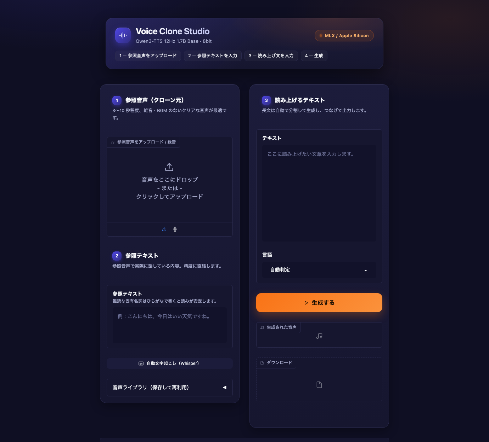

# Qwen3-TTS Voice Clone (MLX / Apple Silicon)

[Qwen3-TTS](https://huggingface.co/Qwen/Qwen3-TTS-12Hz-1.7B-Base) をローカル（Apple Silicon）で動かす、**ボイスクローン専用**の Gradio UI です。参照音声をアップロードするだけで、その声で任意のテキストを読み上げます。クラウドへの送信は一切ありません。



- モデル: `mlx-community/Qwen3-TTS-12Hz-1.7B-Base-8bit`（8bit 量子化 / 約 3.1GB）
- 推論: [mlx-audio](https://github.com/Blaizzy/mlx-audio)（Apple Silicon の MLX 上で動作）
- 対応言語: 日本語・英語・中国語・韓国語・ドイツ語・フランス語・イタリア語・スペイン語・ポルトガル語・ロシア語

## 動作環境

- Apple Silicon の Mac（M1 以降）。MLX を使うため Intel Mac では動きません
- macOS 14 以降
- Python 3.12
- 空きディスク 約 5GB（モデル 3.1GB ＋ 自動文字起こし用 Whisper 1.6GB）
- メモリ 16GB 以上を推奨

## セットアップ

```bash
git clone https://github.com/hong8300/qwen3-tts-voice-clone-mlx.git
cd qwen3-tts-voice-clone-mlx

# uv を使う場合
uv venv --python 3.12 .venv
VIRTUAL_ENV=.venv uv pip install -r requirements.txt

# venv + pip を使う場合
# python3.12 -m venv .venv && .venv/bin/pip install -r requirements.txt
```

モデルは初回起動時に Hugging Face から自動でダウンロードされ、`~/.cache/huggingface/hub/` に保存されます。事前に取得しておくこともできます。

```bash
.venv/bin/hf download mlx-community/Qwen3-TTS-12Hz-1.7B-Base-8bit
```

## 起動

```bash
./run.sh
```

http://127.0.0.1:7860 が自動で開きます。停止は `Ctrl+C`。

## 使い方

1. **参照音声をアップロード** — クローンしたい声。**3〜10 秒程度**、雑音・BGM・複数話者なしのクリアな音声が最適。マイク録音も可
2. **参照テキストを入力** — その音声で実際に話している内容。`🎧 自動文字起こし` ボタンで Whisper に書き起こさせることもできます
3. **読み上げるテキストを入力** → `🔊 生成`
4. 生成音声は再生・ダウンロードできるほか、`outputs/` に日時つき WAV（24kHz）で自動保存されます

よく使う声は「音声ライブラリ」から名前をつけて保存すると、参照音声と参照テキストのペアが `voices/` に保存され、次回から選ぶだけで再利用できます。

> `outputs/` と `voices/` は `.gitignore` 済みです。音声データが誤ってコミットされることはありません。

## 参照テキストが精度を左右する

このモデルの声の再現には **ICL（In-Context Learning）モード**が使われます。内部では参照テキストと読み上げテキストが 1 本のテキスト列として連結され、その隣に参照音声をコーデック化したトークン列が置かれます。

```
テキスト列: [参照テキスト][読み上げテキスト][EOS]
音声列:     [参照音声のコーデック] → ここから先をモデルが生成
```

つまりモデルは「**このテキストは、この声のこの音になる**」という対応例を 1 つ見たうえで、続きを同じ声で生成します。参照テキストは、手持ちの音声がどの文字に対応するかを示す**位置合わせの手がかり**です。

このため:

- **参照テキストは必ず入力してください。** 空欄だと話者埋め込みのみの簡易モードに落ち、再現精度が明確に下がります（UI が警告を出します）
- 内容がずれていると対応関係が崩れ、似ない・抑揚が不自然・音が飛ぶといった劣化が出ます
- 句読点の有無や軽い表記ゆれは問題ありません。実測では句読点が全部落ちた自動文字起こしでも正常にクローンできました
- 参照テキストの内容が読み上げられることはありません
- 同じ参照音声＋参照テキストの組み合わせは内部キャッシュが効き、2 回目以降が少し速くなります

## 日本語テキストの書き方

**通常どおり漢字かな交じりで書いてください。** 全部ひらがなにする必要はありません。生成音声を Whisper で書き起こして読みを検証した結果です。

| 入力 | 生成音声の聞き取り | 判定 |
| --- | --- | --- |
| `明日の会議は十時から第一会議室で行います。` | 明日の会議は10時から第1会議室で行います | ✅ `行います`→「おこないます」、`十時`→「じゅうじ」 |
| `1200円を3人で割ると400円です。` | 1200円を3人で割ると400円です | ✅ 「せんにひゃくえん」と正しく読む |
| `本日は貴重なお時間をいただき…資料の三ページ目を…` | 本日は貴重なお時間をいただき…資料の3ページ目を… | ✅ 長文も問題なし |
| `小鳥遊さんと月見里さんが来ました。` | 小鳥**康**さんと月**ミラト**さんが来ました | ❌ 難読名は読めない |
| `たかなしさんとやまなしさんがきました。` | 高梨さんと山梨さんが来ました | ✅ ひらがなで正解 |

常用の範囲の漢字は正しく読み分けられ、数字も漢数字・算用数字どちらでも文脈に応じた読みになりました。

一方で **難読の固有名詞は読めません**。そこだけピンポイントでひらがな（またはカタカナ）に置き換えるのが正しい使い方です。

```
小鳥遊さん  →  たかなしさん
代替案      →  だいたいあん
```

全文をひらがなにするのは勧めません。普通の文ならひらがなでも読めましたが、利点がない一方で語の切れ目がモデルの推測任せになります。実測でも `にわにはにわにわとりがいる` が「**2羽には**2羽鶏がいる」と分節を誤りました。

この UI にアクセント辞書の機能はないため、読みの制御は**表記で行うのが唯一の手段**です。どうしても直らない語は言い換えてください。

## 設定項目

| 項目 | 既定値 | 説明 |
| --- | --- | --- |
| 言語 | 自動判定 | 上記 10 言語に対応 |
| temperature | 0.9 | 高いほど抑揚が豊かで不安定。落ち着かせたいなら 0.7 前後 |
| top_k / top_p | 50 / 1.0 | サンプリング範囲 |
| repetition_penalty | 1.5 | 下げると同じ音の繰り返しが出やすい。ICL モードでは 1.5 が下限として強制される |
| max_tokens | 2048 | 1 チャンクあたりの上限。12.5 トークン ≒ 1 秒 |
| シード | -1 | 固定すると同じ結果を再現できる |
| 分割文字数 | 150 | 長文はこの長さを上限に文単位で自動分割して順に生成する |
| チャンク間の無音 | 0.2 秒 | 分割生成した音声をつなぐ際の間 |

長文が自動分割されるのは、ICL モードでは mlx-audio 側がテキスト分割を行わないためです。本アプリが文単位でチャンクに分け、逐次生成して無音を挟み結合しています。

## 環境変数

| 変数 | 既定値 |
| --- | --- |
| `QWEN3_TTS_MODEL` | `mlx-community/Qwen3-TTS-12Hz-1.7B-Base-8bit` |
| `QWEN3_TTS_STT_MODEL` | `mlx-community/whisper-large-v3-turbo-asr-fp16` |
| `QWEN3_TTS_HOST` / `QWEN3_TTS_PORT` | `127.0.0.1` / `7860` |
| `QWEN3_TTS_PRELOAD` | `1`（`0` で初回生成時まで読み込みを遅延） |

同じ LAN の別端末から使う場合:

```bash
QWEN3_TTS_HOST=0.0.0.0 ./run.sh
```

## 構成

| ファイル | 役割 |
| --- | --- |
| `app.py` | Gradio UI と生成処理 |
| `theme.py` | 配色・CSS・アイコン（見た目のみ。書き換えても機能には影響しない） |
| `run.sh` | 起動スクリプト |
| `outputs/` | 生成音声の保存先（Git 管理外） |
| `voices/` | 音声ライブラリの保存先（Git 管理外） |

配色を変えたい場合は `theme.py` 冒頭のカラートークン（`BG` / `ACCENT` など）を書き換えてください。

## 性能（M1 Max / 32GB 実測）

| 項目 | 値 |
| --- | --- |
| モデル読み込み | 1.6〜3.9 秒 |
| RTF（生成時間 ÷ 音声長） | 0.57〜0.74 |
| 例 | 5 秒の音声が 3〜4 秒で生成 |

## トラブルシューティング

| 症状 | 対処 |
| --- | --- |
| 声が似ない | 参照テキストが空、または音声と食い違っていないか確認。参照音声を雑音のないものに差し替える |
| 同じ音を繰り返す | `repetition_penalty` を上げる、`temperature` を下げる |
| 読みが違う | 該当箇所をひらがなに置き換える（上記「日本語テキストの書き方」） |
| 抑揚が不自然 | `temperature` を 0.7 前後に下げる |
| 長文の途中で崩れる | 「分割文字数」を小さく（100 前後）する |

## 他モデルへの差し替え

同じ Qwen3-TTS ファミリの MLX 版に差し替えられます。ただし本 UI はクローン専用のため、`Base` 系以外は想定どおり動きません。

```bash
QWEN3_TTS_MODEL=mlx-community/Qwen3-TTS-12Hz-1.7B-Base-bf16 ./run.sh  # 非量子化版
QWEN3_TTS_MODEL=mlx-community/Qwen3-TTS-12Hz-0.6B-Base-8bit ./run.sh  # 軽量版
```

## ライセンスと注意

- 本リポジトリのコードは MIT ライセンスです（`LICENSE` 参照）
- モデルの重みは Qwen3-TTS のライセンス（Apache 2.0）に従います
- **他人の声をクローンする場合は、必ず本人の同意を得たうえで利用してください。** なりすまし、詐欺、名誉毀損などへの利用は固く禁じます
